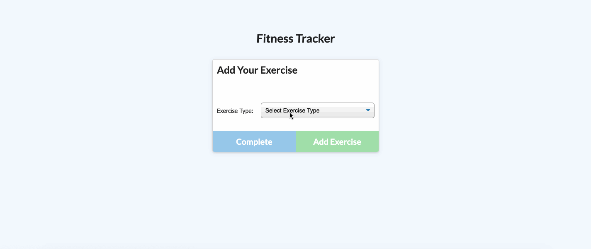

# Unit Unit 17 Nosql Homework - Workout Tracker

## Description

For this assignment, you'll create a workout tracker. You have already been provided with the front end code in the Develop folder. This assignment will require you to create Mongo database with a Mongoose schema and handle routes with Express.

## User Story

    AS A user
    I WANT to log multiple exercises in a workout on a given day
    SO THAT I can view and track daily workouts

## Criteria

    GIVEN the name, type, weight, sets, reps, and duration of exercise

    WHEN the user selects new workout
    THEN a dropdown bar will appear prompting the user to select the type of exercise
    WHEN the user selects the type of exercise
    THEN the user must input information about the exercise based on the exercise type selected
    WHEN all the fields are have been filled with the necessary requirements
    THEN the user will select add exercise to add it to the workout list
    WHEN the user finishes inputting their exercises
    THEN the user will select complete
    WHEN the user selects complete
    THEN the user will see a summary of the exercises inputted

## Heroku Link

The link below will give you access to the web application via the Heroku web service:

https://ghazi-workout-tracker.herokuapp.com/

## Requirements

When the user loads the page, they should be given the option to create a new workout, or continue with their last workout.

The user should be able to:

- Add exercises to a previous workout plan.
- Add new exercises to a new workout plan.
- View multiple the combined weight of multiple exercises on the stats page.

## Local Environment Installation

To run the application locally, first clone this repository with the following command: 

    https://github.com/dghazi12/davidaghazi17.github.io.git

Next, install the application dependencies:

    npm install

Lastly, start the application server using the command line below:

    node server.js

## Preview

